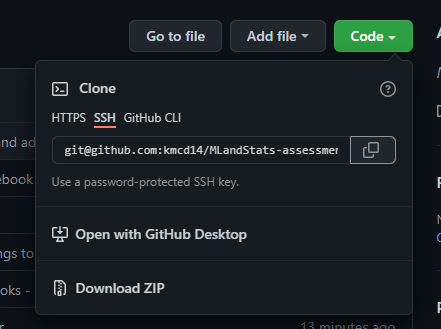

<br></br>

# MACHINE LEARNING AND STATISTICS ASSESSMENT

<br>


<br></br>
This repository contains Jupyter notebooks and other relevant files relating to the module assessment for Machine Learning and Statistics.

 This `README.md` file contains the documentation for technologies and libraries used for the project. 


All notebooks and all other relevant files can be found at: https://github.com/kmcd14/MLandStats-assessment.

<br>

---

<br>
<h2><u>Table of Contents</u></h2></summary>
<br>
  <ol>
    <li><a href='#Description'> Description</a></li>
    <li><a href="#Script">How To Get The Repository on Your Machine</a></li>
    <li><a href="#Jupyter">Running Jupyter Notebook</a></li>
    <li><a href='#Technologies_Used'>Technologies Used</a></li>
    <li><a href="#Libraries_Used">Libraries Used</a></li>
    <li><a href="#contact">Contact</a></li>
    
  </ol>
<br>

---
  
---

<br>

<h2><b><u><p id='Description'> Description</b></u></p></h2>

<br>

<h3><u>Scikit-Learn</u></h3>

<br>

`scikit-learn` enables us to implement some of the most popular machine learning algorithms out of the box. The aim of this notebook is to provide a clear and concise overview of the python package `scikit-learn`. This will be achieved by researching the package and demonstrating its functionality through three algorithms of choice.

<br>

 <h4><u> Objectives and to do list: </u></h4>
 <ul>
  <li>Explain the overall purpose of the package.</li>
  <li>Demonstrate three algorithms the package contains. </li>
  <li>A clear and informative READMe file.</li>
  <li>A requirements.txt file.</li>
</ul>

</br>

The power of machine learning is that it provides the tools to constantly learn from data, which in turn can help predict future outcomes. Machine learning uses different algorithms that continuously learn from data.

It is a type of artificial intelligence which allows systems to learn from data rather than through distinct programming. By using training data, we can build increasingly more precise models based on that data. Data is trained so it can be characterised and improve output and predictions.


II found this project really interesting as it is the first time, I have had any experience with machine learning. I also found it enjoyable to get first-hand experience, although at times quite challenging to get to grips with, in equal measure as there is so much material to cover! 

Overall, I learnt a lot by doing this project. I had no previous experience with the topic. It is such a vast area and there are so many paths you could go with it; it can be overwhelming. I look forward to continued learning and improving and building my knowledge base in the area. 


<br></br>

<h3><u>Scipy-Stats</u></h3>

<br>

The aim of the `scipy-stats.ipynb` notebook is to provide a clear and concise overview of the python package `scipy` and more specially the module `scipy-stats` and an example hypothesis test using ANOVA. This will be achieved by researching the package and demonstrating its functionality and finding a using a data set for which using ANOVA is suitable.


<br>

 <h4><u> Objectives and to do list: </u></h4>
 <ul>
  <li> Give a clear and concise overview of the package.</li>
  <li>Conduct an example hypothesis test using ANOVA.</li>
    - Find an appropriate dataset to use for the ANOVA test.
  <li>A clear and informative READMe file.</li>
  <li>A requirements.txt file.</li>
</ul>

</br>


I found this project quite difficult; I believe I have given a clear overview of the `scipy-stats` but I found the ANOVA testing the most difficult part. I found a number of datasets and ran ANOVA testing on them, but they never worked out for e.g. they were too skewed. Which I found strange as quite a few were used in hypothesis testing examples! 

In the future I will definitely be spending more time getting to grips with ANOVA - the YouTube tutorials made it seem so simple - and becoming a braver and by my hand at a two-way and n-way ANOVA test.

<br>

---

<br><br>

<h2><b><u><p id='Script'> How To Get The Repository on Your Machine</b></u></p></h2>
<br>
<ol>

<li>Using your browser navigate to the repository:  

https://github.com/kmcd14/MLandStats-assessment


<br> </il>




<br>

<li>Under clone, copy the repository address, as seen in the above picture, using either SSH or HTTPS</li>
<li> Open your terminal.</li>
<li> Navigate to the location where you want to store the cloned directory.</li>
<li>In the terminal type the command:

<br>

<br>

    
    $git clone git@github.com:kmcd14/MLandStats-assessment.git

<br>
</li>
<li>Press enter. The cloned repository is now on your machine.
</li>
</ol>


<br></br>

---
<br></br>
<h2><b><u><p id='Jupyter'>Running Jupyter Notebook</p></b></u></p></h2>

<br>

The easiest way to run the notebooks is by python installed via the Anaconda distribution. 
Anaconda is the most widely used python distribution in data science fields as it comes preloaded with most of the most popular packages and tools. You can find out more about Anaconda and how to install it here
  https://docs.anaconda.com/.

<br>

You can forgo downloading Anaconda and install each package individually in the python shell. A full list of requirements for each notebook can be found in the `requirements.txt` file in this repository. Full details and links to each package used can be found further down in this README. 

<br>
Additionally, if you wish to view the notebook without having to install additional requirements, please click on the following badges to be redirected in your browser. 

<br> </br>

`scikit-learn.ipynb`

[](https://nbviewer.org/github/kmcd14/MLandStats-assessment/blob/main/scikit-learn.ipynb)

<br> </br>

`scipy-stats.ipynb`

[](https://nbviewer.org/github/kmcd14/MLandStats-assessment/blob/main/scipy-stats.ipynb)

<br>
<br>

### Opening and Running The Notebook

<br>

  
  - From the command line navigate to the folder you have cloned the repository to.
  - Type `jupyter lab` or `jupyter notebook` into the command line and press enter to launch the jupyter interface.
<br></br>
  
  <br></br>

  - In the side panel you will see all files in the repository as seen in the above image. 
  - Click on `scikit-learn.ipynb` or `scipy-stats.ipynb` to open the notebook.
  - To run the code in a cell, hold down the `shift key` and press `enter` or click `Kernel` in the top toolbar and run all cells.
  - To change between edit and read mode at any time press the `ESC key`.
  - When you have finished, shut down the kernel via file > shut down in the browser, close the browser and press `Ctrl + C` on the command line to terminate the programme.

<br></br>
Note: 

If the Jupyter interface doesn't automatically open in your browser try specifying the browser e.g.:

<br>

      jupyter lab —browser=chrome

<br>
Jupyter Notebook has a full troubleshooting guide which can be found:

 https://jupyter-notebook.readthedocs.io/en/stable/troubleshooting.html
<br></br>


---


<br></br>
<h2><b><u><p id='Technologies_Used'> Technologies Used:</b></u></p></h2>
<br>
<b><u>Google Docs:</u></b> an online word processor used to write my documentation before transferring into this README file. 

https://www.google.com/docs/about/
<br></br>
<b><u>Anaconda:</u></b> the easiest way to perform Python data science machine learning on Windows, Linux and Mac OS. This script was created using Version 4.9.2. https://www.anaconda.com/distribution/
<br></br>
<b><u>Python:</u></b> an interpreted, object-oriented, high-level programming language with dynamic semantics. This script was created using Version 3.8.5. 
https://www.python.org/
<br></br>
<b><u>GitHub:</u></b> is a code hosting platform for collaboration and version control. https://github.com/
<br></br>
<b><u>Jupyter Lab/Jupyter Notebook:</u></b> a web-based interactive development environment for Jupyter notebooks, code, and data. https://jupyter.org/
<br></br>
<b><u>NBViewer:</u></b> a web application which enables you enter the URL of a Jupyter Notebook file, renders that notebook as a static HTML web page, and gives you a stable link to that page which you can share with others. https://nbviewer.org/

<br></br>
<br></br>


---

<br></br>
<h2><b><u><p id='Libraries_Used'>Libraries Used:</b></u></p></h2>

Python has a vast and continuously growing library to choose from which makes it perfect for data analysis, such as NumPy and Pandas. It is a robust, flexible and efficient language which provides many solutions and avenues to approach and solve problems.

<br>

<b><u>A full list of each notebook’s requirements can be found in the 
`requirements.txt` file in the project repository. </u></b>


<br>

<u><b>NumPy</b></u> is a Python library used for working with arrays. It produces a narray object. NumPy arrays are faster and more efficient than using python lists. It does this by storing arrays in one place in memory, so they can be accessed and manipulated quickly http://www.numpy.org/

<br>

<u><b>Mathplotlib</b></u> is a python library used to create plots, graphs, charts etc. https://matplotlib.org/

<br>

<u><b>Pandas</b></u> is a data manipulation tool built on NumPy. Its key structure is the dataframe. You can think of a dataframe as a spreadsheet or table but, dataframes as are more efficient and powerful and are an integral part of Python and NumPy. Pandas will allow us to select specific rows and columns within the dataframe. https://pandas.pydata.org/

<br>

<u><b>Scikit-Learn</b></u> is a library in python that provides many unsupervised and supervised learning algorithms. It is one of the most popular and best-known packages to do so. The package which provides users with efficient versions of a large number of common algorithms used in machine learning. It also features helpers to fetch larger datasets commonly used by the machine learning community to benchmark algorithms on data that comes from the ‘real world’. https://scikit-learn.org/

<br>

<u><b>Seaborn</b></u> is based on matplotlib and is also used to create data visualisations. “It provides a high-level interface for drawing attractive and informative statistical graphics.” https://seaborn.pydata.org/

<br>

<u><b>Statsmodel</b></u> is a python package which enables users to explore data, estimate statistical models, and conduct statistical tests. https://www.statsmodels.org/

<br>


<br>

<u><b>If your system does not have these libraries installed enter the below command from the command line: </b></u>


<br>

```
    $pip install <library name>
```

<br></br>


---

<br>

<h2><b><u><p id='contact'>Contact:</b></u></p></h2>

<a href="mailto:katieisanimdom@ygmail.com">katieisanimdom@gmail.com</a>  
